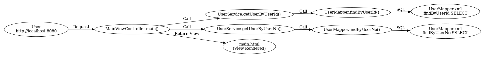
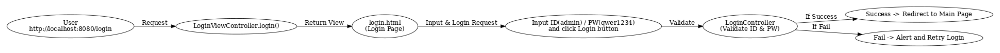

# 프로젝트 설명

| Java 패키지                                                       | 설명                                  |
|----------------------------------------------------------------|-------------------------------------|
| [config](src/main/java/com/silvercall/config)                  | Spring boot configuration           |
| [constants](src/main/java/com/silvercall/constants)            | 프로젝트에서 공통으로 참조할 상수                  |
| [request](src/main/java/com/silvercall/dto/request)            | 외부 요청                               |
| [response](src/main/java/com/silvercall/dto/response)          | 외부 요청에 대한 응답                        |
| [lang](src/main/java/com/silvercall/lang)                      | 외부 요청에 대한 응답                        |
| [p6spy](src/main/java/com/silvercall/p6spy)                    | Query 로깅 포멧                         |
| [mapper](src/main/java/com/silvercall/persistence/mapper)      | MyBatis와 연동된 Mapper                 |
| [model](src/main/java/com/silvercall/persistence/model)        | MyBatis를 이용해서 DB에서 조회된 정보를 담는 Model |
| [service](src/main/java/com/silvercall/service)                | 비지니스 로직을 처리하는 Service               |
| [util](src/main/java/com/silvercall/util)                      | 유틸리티 모음                             |
| [filter](src/main/java/com/silvercall/web/filter)              | Servlet Filter 모음                   |
| [lang](src/main/java/com/silvercall/web/lang)                  | 프로젝트 표준 Class 모음                    |
| [controller](src/main/java/com/silvercall/web/rest/controller) | Restful API Controller              |
| [controller](src/main/java/com/silvercall/web/view/controller) | Thymeleaf View 연동 Controller        |

| Resources 패키지                                                  | 설명                      |
|----------------------------------------------------------------|-------------------------|
| [mapper](src/main/resources/com/silvercall/persistence/mapper) | MyBatis XML Mapper 모음   |
| [db](src/main/resources/db)                                    | DB 샘플 스키마               |
| [messages](src/main/resources/messages)                        | 프로젝트에서 외부로 노출하는 Message |
| [css](src/main/resources/static/css)                           | CSS 파일 파일 위치            |
| [error](src/main/resources/static/error)                       | Error 페이지 CSS           |
| [fonts](src/main/resources/static/fonts)                       | 폰트 파일 위치                |
| [js](src/main/resources/static/js)                             | 자바스크립트 파일 위치            |
| [vendor](src/main/resources/static/vendor)                     | 외부 자바스크립트 파일 위치         |
| [error](src/main/resources/templates/error)                    | Error View 페이지 파일 위칭    |
| [view](src/main/resources/templates/view)                      | 서비스 View 페이지 파일 위칭      |

## Main 페이지 설명
1. 사용자가 http://localhost:8080 요청
2. [MainViewController.java](src/main/java/com/silvercall/web/view/controller/MainViewController.java)의 main Method가 접소
3. main -> [UserService.java](src/main/java/com/silvercall/service/UserService.java)의 getUserByUserId Method 호출 
4. getUserByUserId -> [UserMapper.java](src/main/java/com/silvercall/persistence/mapper/UserMapper.java)의 findByUserId Method 호출 
5. findByUserId -> [UserMapper.xml](src/main/resources/com/silvercall/persistence/mapper/UserMapper.xml)의 findByUserId select 호출 
6. main -> [UserService.java](src/main/java/com/silvercall/service/UserService.java)의 getUserByUserNo Method 호출 
7. getUserByUserNo -> [UserMapper.java](src/main/java/com/silvercall/persistence/mapper/UserMapper.java)의 findByUserNo Method 호출 
8. findByUserNo -> [UserMapper.xml](src/main/resources/com/silvercall/persistence/mapper/UserMapper.xml)의 findByUserNo select 호출 
9. main에서 "view/main" 리턴 -> [main.html](src/main/resources/templates/view/main.html) 페이지 사용자에 노출

## 로그인 페이지 설명
1. 사용자가 http://localhost:8080/login 요청
2. [LoginViewController.java](src/main/java/com/silvercall/web/view/controller/LoginViewController.java)의 login Method가 접소
3. [login.html](src/main/resources/templates/view/login.html) 페이지 사용자에 노출
4. 로그인 페이지에서 아이디(admin) / 비밀번호(qwer1234) 입력 후 로그인 버튼 클릭
5. [LoginController.java](src/main/java/com/silvercall/web/rest/controller/LoginController.java)의 아이디 / 비밀번호 유효성 검증 후 성공 / 실패 리턴
6. 성공 시 main 페이지로 이동
7. 실패 시 실패 Alert 출력후 다시 로그인 시도 요청

